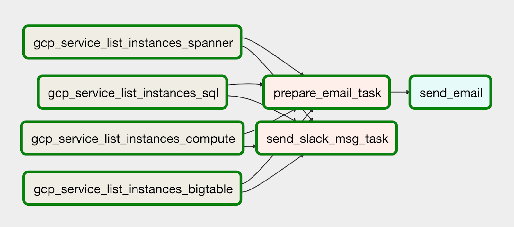

# airflow-gcp-spy
An Airflow demo DAG that fetches lists of running instances from different GCP services and sends them to a Slack channel and via e-mail.

### Purpose

The purpose of this project is to demonstrate the funtionality of Airflow on a simple
example.

The diagram represents all the tasks and relationships in the workflow:

### Running the DAG

The easiest way to run this demo DAG is using [Google Cloud Composer](https://cloud.google.com/composer/).

All you need to do is upload the DAG to the GCS bucket created by Composer and
configure the 2 environment variables mentioned below in *Prerequisites*. 

In case you wanted to run it in an Airflow installation outside of the Google Cloud 
Platform (GCP), you would need to ensure that `gcloud` is installed and available to 
Airflow, and you would have to authenticate `gloud` to your GCP project 
before running the DAG.

### Prerequisites

You need 2 environment variables in your Airflow cluster for the DAG to work:
- `GCPSPY_SLACK_WEBHOOK` - webhook URL to a Slack channel
- `GCPSPY_RECIPIENT_EMAIL` - e-mail notification's recipient address

